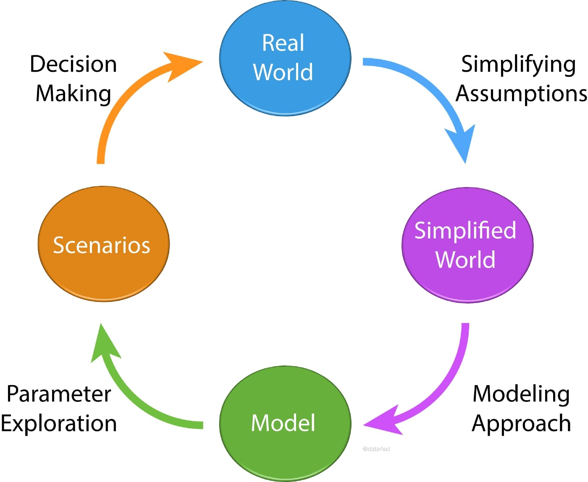

# All Models are Wrong, but some are useful

## General information
Was a statement from George Box (1976) \
Means having more focus on applying things in daily life in a useful way instead of debating about it endlessly \
The true test of knowledge is not the truth but the utility \
\
“all models are wrong, but some are useful” \
This is perhaps never more true than during a crisis. \
Information is limited, often wrong, but decisions must be made and implemented based on what is known at the time.


## Representation of the mental model

```
Once a working model is obtained, we can use it to explore scenarios, the consequences 
of specific decisions, etc. Finally, it is by studying the scenarios that are outputted 
by our models that decisions are taken in the Real World. Graphically, we have:
```



```
Naturally, this is a simplified and schematic view (and a model in and of itself) to 
help illustrate the various points at which our modeling efforts can go awry, 
leading the results of our models to differ from what we actually observe in the real world.
```


---
### Sources
1. [All Models Are Wrong, Some Are Useful - James Clear](https://jamesclear.com/all-models-are-wrong)
2. [Image of All Models are Wrong](https://medium.data4sci.com/epidemic-modeling-102-all-covid-19-models-are-wrong-but-some-are-useful-c81202cc6ee9)
3. [All Models Are Wrong - fs-blog](https://fs.blog/all-models-are-wrong/)
