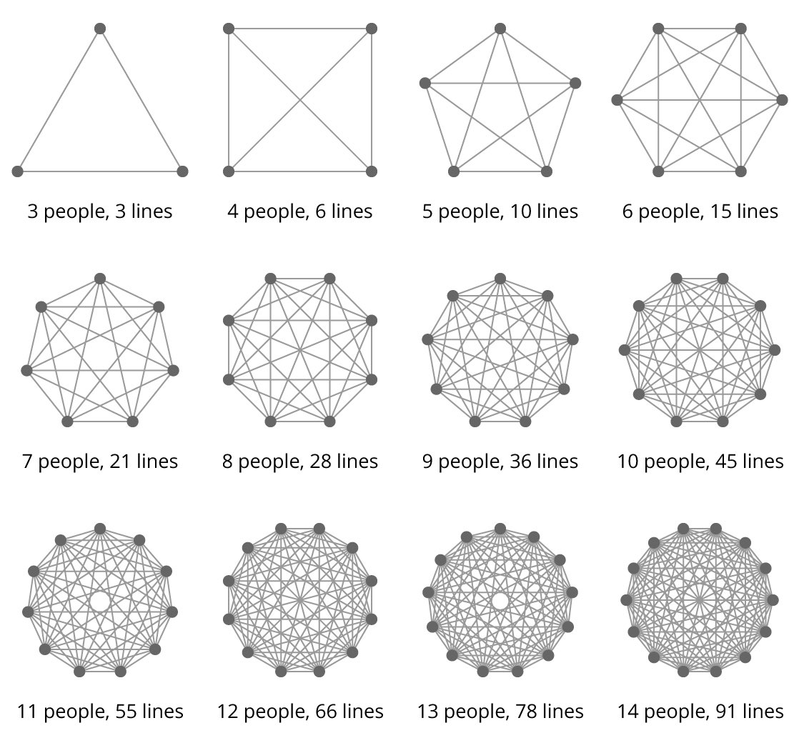

# Brook's law

## General information
Brooks’s Law: ”adding human resources to a late software project makes it later” \
\
The number of possible communication channels grows much faster, and at a certain point each additional person becomes a net loss

## Representation of the mental model

```
Most teams in large enterprises have between 10 and 20 members. 
Even at the low end of that scale, a team has so many lines of communication that progress is bound to be slow.
```



```
1. Overstaffed: 
Maybe the tasks aren’t really parallelizable, which means the organization incurs increased coordination overhead through meetings?

2. Technical Debt and Code Health: 
Could it be that the organization has taken on excess technical debt that is now hurting the progress?

3. On-Boarding Costs: 
Maybe the project is indeed appropriately staffed, but the decline in output is due to accumulated on-boarding costs?
```

### Sources
1. [Brooks law - CodeScene](https://codescene.com/blog/visualize-brooks-law/)
2. [Applying Brooks' Law to Lines of Communication - DZone](https://dzone.com/articles/applying-brooks-law-to-lines-of-communication-and)
3. [Mythical Man Month: Why More Manpower Doesn’t Mean Faster Work](https://www.youtube.com/watch?v=Xsd7rJMmZHg)
