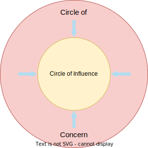
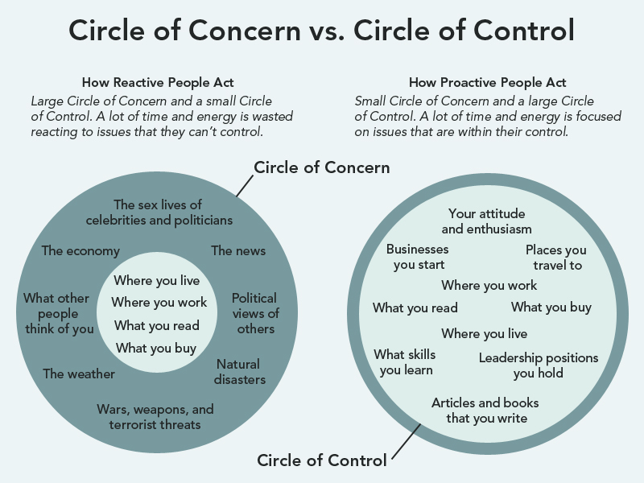

# Circle Of Influence

💡 Circle of influence refers to the area of your life where you can actually make changes. It is that circle of your life where you focus your energy to become your best version. It also helps to regain your control of important things.

Those who effectively embrace change, focus their time and energy on things they actually have control over, instead of wasting their time and energy on things they don’t.

# Proactive Focus

---

Positive energy enlarges Circle of Influence

### How Proactive People Act

> “Small Circle of Concern and a large Circle of Control. A lot of time and energy is focused on issues that are within their control.”

# Reactive Focus

---

Negative Energy Reduces Circle of Influence

### How Reactive People Act

> “Large Circle of Concern and small Circle of Control. A lot of time and energy is wasted reacting to issues that they can’t control.”

## Examples

---

In the following picture you can see different things for both Circles.

## Question to ask yourself

---

1. Where are you currently spending the majority of your focus & time?
2. Are you currently being as personally effective as you can in your life?
3. What strategies or tools could you use to help you focus on the things you can control and transform your life?
4. What can you do today to expand your Circle of Influence to build more positive energy in your life and at work?

## Sources

---

[Circle of Influence — Energie und Kapazität für das eigene Wirken finden](https://medium.com/das-rehbock/circle-of-influence-energie-und-kapazit%C3%A4t-f%C3%BCr-das-eigene-wirken-finden-14aca3dad09c )

[What Can I do? The Circles of Concern and Influence](https://www.abrahampc.com/blog/2020/3/16/what-can-i-do-the-circles-of-concern-and-influence)