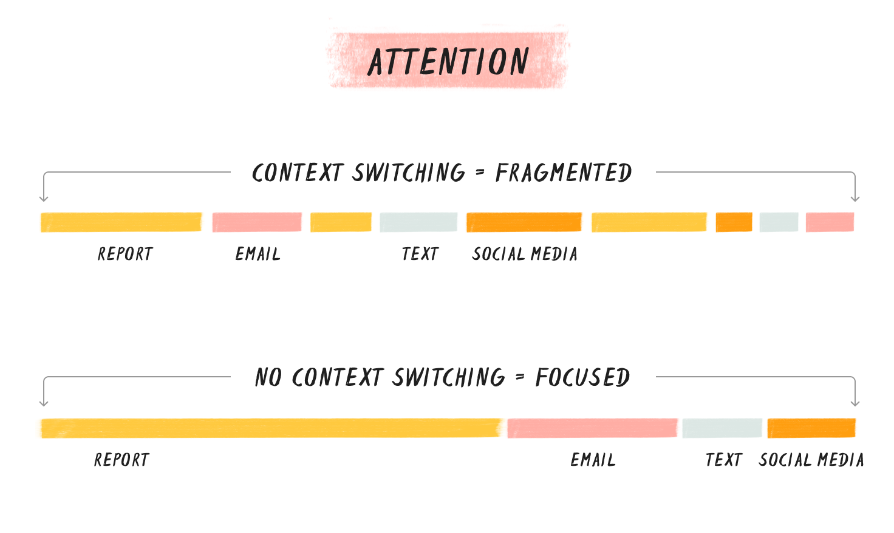

# Context Switching and Productivity

Context switching is part of many people's life nowadays. It describes the state in which we are constantly toggling between news, alerts, emails, messages, tasks, apps, tabs, screens, etc. We explain you, why numerous people share this problem and how you can deal with it and start working more focused. 

## What is context switching? 

The expression originally comes from computing and describes how operating systems can handle multiple processes. When humans try to imitate that, they will notice that it cuts short on our time and focus.



---
```
When switching contexts,each component of what we are doing
(screens, tasks, programs) becomes a fragment of our attention.
```

Example: You are writing a report and get an email from your boss. You click on the mail and read it quickly. It is not a big task, something that you can do at the end of the week. You switch back to your report. Part of your attention still sticks to the mail. This is called **attention residue**. Like this you pay an **attention tax**, meaning lost time and productivity. LeRoy describes this as follows: “People experiencing attention residue after switching tasks are likely to demonstrate poor performance on that next task. The thicker the residue, the worse the performance.”
## Why do we context switch?
If context switching is something bad that diminishes our productivity, then why do we do it?
There are 3 main reasons for it:

### "You Got Mail"
Our digital tools are designed to interrupt. No matter if its WhatsApp, Facebook, another instant messaging platform or even Email;
With features like notifications and unread message symbols, our technology is designed by default to interrupt us.

### Work culture rewards responsiveness
This also exacerbates the next hazard: Context switching is inevitable in “always on,” workplaces, where
there’s a real or perceived expectation that team members respond immediately to emails and team messaging tools.

### We are our own worst enemy
And the last and most surprising thing to watch out for: Interruptions aren’t just external. We’re actually just as likely to interrupt ourselves as we are to be interrupted.
How many times have you had free time and wanted to use it to get something done, but instead you just did something unrelated, like maybe watching funny animal videos?

## The costs of context switching

### Kills productivity
- slow thoughts and decisions
  - can take up to 23 Minutes to re-focus after returning to a task
  - context switching can take up to 40% of a person's productive time

### impedes cognitive function
- Our limited "brain storage" will be flooded whenever you do something that is another topic you have not been working on.
  - e.g. News headlines, statistic reports, ...
  
### diminishes attention
 - Isaac Newton: "If I have made any valuable discoveries, it has been owing more to patient attention than to any other talent"
   - our attention is reduced by a huge amount by context switching even if it is our most important resource.
### Depletes energy
   - Our brains are not as good as phones are. Because of that we need to take some breaks when consuming information. 
Other ways we can't keep up with all the information so that our energy will drop.

### Confuses priorities
- Our priorities will be at what's right in front of us and the most easy thing to do. Because of that we start to work on tasks that are more low-valued (like responding to emails).
  - Our brain switches to "survival mode" where our stress leads to the need of accomplishing at least one thing.

## Strategies to prevent context switching:

### Bullet Point List
Thinking about another task splits your concentration and makes it harder to focus on what’s in front of you at the moment.

### Prioritize tasks
Deciding what to do and what to do next can become its own distraction.
You can decide what to focus on with the Eisenhower decision matrix for example.

### Structure your day
Choose a method like “time blocking” or the “Pomodoro method” to stay focused

### Screen-free breaks
When you step back from your computer, you give your brain a chance to refresh and recharge

### Develop awareness of distraction
To break a habit is to become aware that you’re doing it and to protocol it. Simply noting a distraction makes the unconscious conscious.

### Eliminate distractions
Keep distracting media closed and muted, when you concentrate on work.

### De-clutter and streamline your digital life
Centralize your tasks and apps into a task manager app like [Todoist](https://todoist.com/).

### Resist the urge to respond right away
Limit yourself to how many times you check email.

### Promote thoughtful communication
Do your part to minimize the context switching others have to do. Be thoughtful about how often you send an email or chat.

### Sources
1. [Context Switching](https://blog.doist.com/context-switching/)
2. [Video - What multitasking does to your brain](https://www.youtube.com/watch?v=tMiyzuO1qMs)
3. [5 diagrams on context switching](https://www.atlassian.com/blog/productivity/context-switching)