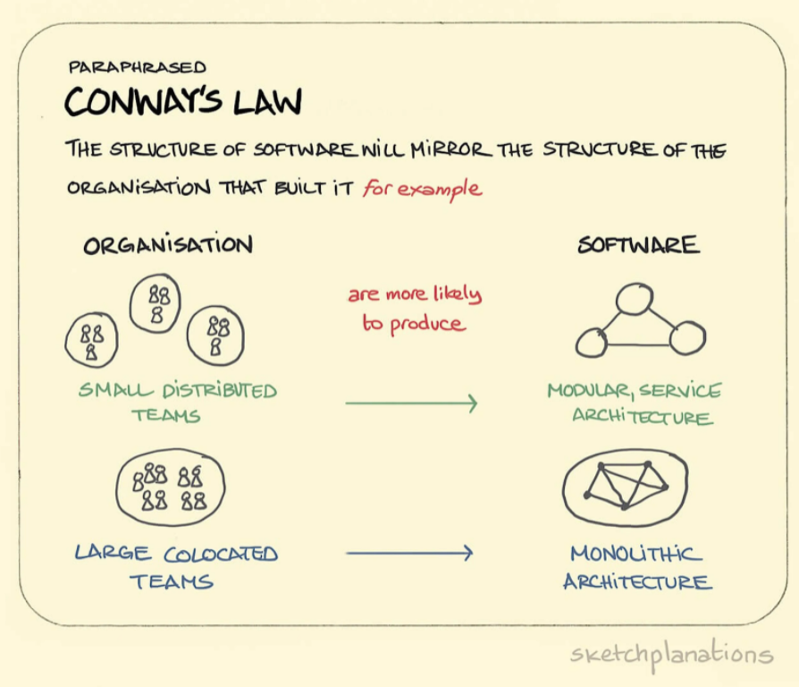

# Conway's Law

## Simple Introduction 
Conway’s Law states that “Organizations, who design systems, are constrained to produce designs which are copies of the communication structures of these organizations.”

Conway’s law and org charts, courtesy of [@sketchplanations](https://twitter.com/sketchplanator/status/1011336633126477825?s=20) | [Sketchplanations Website](https://sketchplanations.com/conways-law)

## Becoming a bit more concrete

Suppose a company is being hired to develop a software system. Said company has 3 teams (E1, E2, E3) working on this project. Conways law suggests that the software architecture is likely to be composed by 3 subsystems S1, S2 & S3. What's more, the quality & type of API between the subsystems (S1 \equiv S2 and so on) will correlate with how well the dev teams of these subsystems communicate & work together.

## The limitations (or lack thereof)

Even though Conway was mostly observing software development, but it could possiby have some application to any large project: cruise ship design, car design, space shuttle design, maybe even governments and law!

## Applying Conway's Law

In agile software development, this realization can lead towards an agile organization in which the system to be created doesn't adapt to the organizational structure, but the organizational structure adapts to the desired system. What is important is the willingness of management to support such an adaptation and reversal.

## Supporting evidence

Conway's Law isn't just a cool idea that some PM-guru came up with! Evidence in support of Conway's law has been published by researchers from  [Harvard Business School](https://www.hbs.edu/faculty/Pages/item.aspx?num=51030) & MIT.