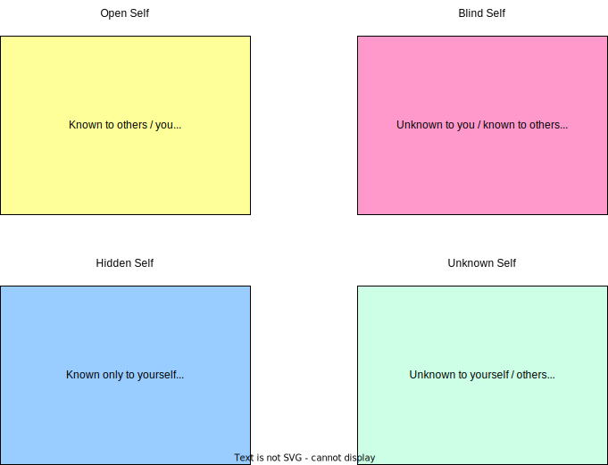

# Johari Window

The Johari Window is a framework for understanding conscious and unconscious bias that can help increase self-awareness and our understanding of others. It is composed of four quadrants in which people using the framework can identify what they know about themselves and what other people know about them. This results in four areas of understanding:

source: own illustration by @2000eBe

It is the creation of two psychologists, Joseph Luft and Harrington Ingham, who named the model by combining their first names.

For some people, the method serves as an information processing aid and increases self awareness. It can represent information about experiences, attitudes, skills and motivations of each person (or a group)

## Sources

[https://www.gartner.com/en/human-resources/glossary/johari-window](https://www.gartner.com/en/human-resources/glossary/johari-window)
[https://github.com/thomykay/devspace-systemsthinking/blob/e73a99affd710d197acfdfa2ad2d18871395ffad/src/material/mentalmodels.johari.md](https://github.com/thomykay/devspace-systemsthinking/blob/e73a99affd710d197acfdfa2ad2d18871395ffad/src/material/mentalmodels.johari.md)
