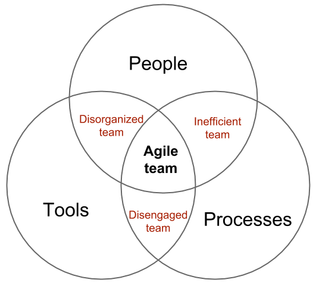

# People-Process-Technology

## General

The people, process, technology (PPT) framework is often used in software companies for information technology management because it helps to map the entire value streams of people, process and technology and thus can optimize operations and ships faster. Its generally about three elements and how they interact with each other.

## People

- Arguably, this is the most crucial part of the triangle. 'People' refers to the workers within an organization. Without people, nothing can happen.
- One of the biggest problems when it comes to this part of the triangle is time. It seems like people are consistently busy.
- When it comes to hiring the right individuals, you should look into their experiences, qualifications, and attitude. It's also important to make sure that you're hiring people who are passionate about the work they're going to be doing.
- At the same time, you have to balance communication between everyone who's a part of the change.

## Process

Processes are the steps or actions that are combined to achieve a specific goal. They describe how we achieve the desired result in an organized way. Key steps, supporting steps, stakeholders, efficiency, …are important things in processes.

## Technology

Technology provides tools that can be used to implement the process. It is important to not always go for the newest shiny tool but for the one which suits your team and process best. So technology should always be the last decision, after everything else is clear.

## Chart

### Sources

- [People-Tools-Processes (Martin Harizanov)](https://harizanov.com/2019/02/people-tools-processes/)

- [People, Process, Technology: The PPT Framework, Explained](https://www.plutora.com/blog/people-process-technology-ppt-framework-explained)
